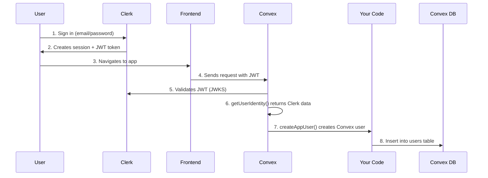

# 🔐 Clerk + Convex Authentication - Complete Explanation

## 🤔 Why Is the Users Table Empty?

**Your Clerk has 1 user (seth@bambl.ing), but Convex users table is empty.**

This is actually **NORMAL** and **BY DESIGN**! Here's why:

---

## 🏗️ Two Separate Systems (By Design)

### Clerk System (Authentication Provider):
```
Tables in Clerk's Database:
├── users                    ✅ 1 user (seth@bambl.ing)
├── sessions                 ✅ Active sessions
├── auth_accounts            ✅ OAuth connections (Spotify, etc.)
└── tokens                   ✅ JWT tokens

Purpose: Handle authentication, OAuth, security
Location: Clerk's cloud (managed service)
```

### Convex System (Your Application Database):
```
Tables in YOUR Convex Database:
├── users                    ❌ EMPTY (needs to be created)
├── artists
├── shows
├── setlists
└── votes

Purpose: Handle app-specific data, business logic
Location: Your Convex deployment
```

---

## 🔄 How They Work Together



### The Flow Explained:

1. **User signs in to Clerk** (via your sign-in page)
   - Clerk stores: session, password hash, email verification
   - Clerk generates: JWT token

2. **JWT contains user identity**:
   ```json
   {
     "sub": "user_2abc123",           // Clerk user ID
     "email": "seth@bambl.ing",
     "name": "Seth",
     "iss": "https://quiet-possum-71.clerk.accounts.dev"
   }
   ```

3. **Frontend automatically sends JWT to Convex**:
   ```typescript
   // This happens automatically via ConvexProviderWithClerk!
   <ConvexProviderWithClerk client={convex} useAuth={useAuth}>
     // Every Convex query/mutation gets the JWT attached
   </ConvexProviderWithClerk>
   ```

4. **Convex validates the JWT**:
   ```typescript
   // convex/auth.config.ts validates JWT signature
   domain: "https://quiet-possum-71.clerk.accounts.dev"
   
   // Convex fetches public keys from:
   // https://quiet-possum-71.clerk.accounts.dev/.well-known/jwks.json
   ```

5. **Your code creates the app user**:
   ```typescript
   // src/App.tsx (lines 44-48)
   useEffect(() => {
     if (user && !user.appUser) {
       createAppUser().catch(console.error);  // ← This creates Convex user
     }
   }, [user, createAppUser]);
   ```

---

## 🎯 The Problem: Environment Variable Name Mismatch

### What I Found:

**In `convex/auth.config.ts`**:
```typescript
domain: process.env.CLERK_ISSUER_URL  // ❌ Wrong variable name
```

**In `.env.local`**:
```bash
CLERK_JWT_ISSUER_DOMAIN=https://quiet-possum-71.clerk.accounts.dev
```

**They don't match!** So Convex couldn't validate JWTs.

### ✅ I Fixed It:

Changed `auth.config.ts` to:
```typescript
domain: process.env.CLERK_JWT_ISSUER_DOMAIN  // ✅ Matches .env.local
```

And set it in Convex:
```bash
npx convex env set CLERK_JWT_ISSUER_DOMAIN "https://quiet-possum-71.clerk.accounts.dev" --prod
```

---

## 📋 What Needs to Happen for Users Table to Populate

### Automatic Flow (After My Fix):

1. ✅ **Sign in to your app** at http://localhost:5173 (or your deployed URL)
2. ✅ **Clerk authenticates you** and creates JWT
3. ✅ **ConvexProviderWithClerk sends JWT** to all Convex requests
4. ✅ **Convex validates JWT** (now works with correct env var!)
5. ✅ **`ctx.auth.getUserIdentity()` returns your identity**
6. ✅ **App.tsx useEffect detects** `user && !user.appUser`
7. ✅ **Calls `createAppUser()` mutation**
8. ✅ **User created in Convex users table!**

---

## 🧪 Testing the Fix

### Step 1: Deploy the fix
```bash
npm run deploy:backend  # Already done! ✅
```

### Step 2: Sign in to your app
```bash
# Start dev server
npm run dev

# Or visit your deployed app
# Sign in with: seth@bambl.ing
```

### Step 3: Check the console
```javascript
// Open browser console, you should see:
// "Auth user created: <userId>"
```

### Step 4: Verify in Convex Dashboard
```bash
# Go to: https://dashboard.convex.dev/d/exuberant-weasel-22/data/users
# You should now see 1 user!
```

---

## 📊 Tables Comparison

### Clerk Tables (Managed by Clerk):
| Table | What It Stores | Who Manages |
|-------|---------------|-------------|
| `users` | Email, password hash, verification status | Clerk |
| `sessions` | Active login sessions | Clerk |
| `auth_accounts` | OAuth connections (Google, Spotify) | Clerk |
| `tokens` | Session tokens, refresh tokens | Clerk |

**You don't access these directly!**

### Your Convex Tables (Your App Data):
| Table | What It Stores | Who Manages |
|-------|---------------|-------------|
| `users` | Username, bio, role, preferences | You |
| `artists` | Artist data, Spotify info | You |
| `shows` | Concert dates, venues | You |
| `setlists` | Song predictions, votes | You |
| `votes` | User votes on songs | You |

**You have full control over these!**

---

## 🔑 Critical Configuration Checklist

### ✅ Frontend (.env.local):
```bash
VITE_CONVEX_URL=https://necessary-mosquito-453.convex.cloud
VITE_CLERK_PUBLISHABLE_KEY=pk_test_cXVpZXQtcG9zc3VtLTcxLmNsZXJrLmFjY291bnRzLmRldiQ
```

### ✅ Convex Environment (Production):
```bash
CLERK_JWT_ISSUER_DOMAIN=https://quiet-possum-71.clerk.accounts.dev
SPOTIFY_CLIENT_ID=<your_id>
SPOTIFY_CLIENT_SECRET=<your_secret>
TICKETMASTER_API_KEY=<your_key>
SETLISTFM_API_KEY=<your_key>
```

### ✅ Clerk Dashboard Settings:

1. **Create JWT Template** (if not already created):
   - Go to: https://dashboard.clerk.com/apps/<your-app>/jwt-templates
   - Click "New template"
   - Name: `convex`
   - Issuer: (leave default)
   - Click "Save"

2. **Get the Issuer URL**:
   - It's shown in the JWT template
   - Should be: `https://quiet-possum-71.clerk.accounts.dev`

### ✅ Code Configuration:

**convex/auth.config.ts** (✅ Fixed):
```typescript
export default {
  providers: [{
    domain: process.env.CLERK_JWT_ISSUER_DOMAIN,
    applicationID: "convex",
  }],
};
```

**src/main.tsx** (✅ Already correct):
```typescript
<ClerkProvider publishableKey={publishableKey}>
  <ConvexProviderWithClerk client={convex} useAuth={useAuth}>
    <App />
  </ConvexProviderWithClerk>
</ClerkProvider>
```

**src/App.tsx** (✅ Already correct):
```typescript
useEffect(() => {
  if (user && !user.appUser) {
    createAppUser().catch(console.error);
  }
}, [user, createAppUser]);
```

---

## 🔍 Debugging Auth Issues

### Check if Clerk JWT is working:

```javascript
// In browser console (when signed in):
import { useAuth } from '@clerk/clerk-react';
const { getToken } = useAuth();
const token = await getToken({ template: 'convex' });
console.log(token);  // Should see a long JWT string
```

### Check if Convex sees the identity:

```typescript
// Add to any Convex query:
const identity = await ctx.auth.getUserIdentity();
console.log('Identity:', identity);
// Should log: { subject: "user_...", email: "...", name: "..." }
```

### Check if user creation is called:

```typescript
// In convex/auth.ts createAppUser mutation, add:
console.log('🔵 Creating app user for:', identity.email);
```

---

## 🎯 Common Issues & Solutions

### Issue 1: "users table is empty"
**Cause**: `createAppUser` hasn't been called yet  
**Solution**: Sign in to the app (triggers the useEffect)

### Issue 2: "ctx.auth.getUserIdentity() returns null"
**Cause**: JWT validation failing  
**Solution**: Check `CLERK_JWT_ISSUER_DOMAIN` matches Clerk dashboard

### Issue 3: "Multiple users in Clerk, none in Convex"
**Cause**: Users signed up in Clerk but never visited app  
**Solution**: Each user must visit app while signed in (triggers `createAppUser`)

### Issue 4: "authId index not found"
**Cause**: Schema not deployed  
**Solution**: Run `npx convex deploy`

---

## ✅ What I Fixed

1. ✅ Changed `CLERK_ISSUER_URL` → `CLERK_JWT_ISSUER_DOMAIN` in `auth.config.ts`
2. ✅ Set environment variable in Convex: `CLERK_JWT_ISSUER_DOMAIN`
3. ✅ Deployed updated configuration

---

## 🧪 Test It Now

```bash
# 1. Start dev server
npm run dev

# 2. Open browser to http://localhost:5173

# 3. Sign in with: seth@bambl.ing

# 4. Check browser console - should see:
# "Auth user created: <userId>"

# 5. Check Convex dashboard:
# https://dashboard.convex.dev/d/necessary-mosquito-453/data/users
# Should now have 1 user!
```

---

## 📚 How It Works (Summary)

1. **Clerk** = Authentication service (manages passwords, sessions, OAuth)
2. **Convex** = Your app database (manages app-specific user data)
3. **JWT** = The bridge between them (Clerk creates, Convex validates)
4. **Your Code** = Creates Convex user when Clerk user first visits app

**Users table in Convex** will populate as users visit the app while signed in!

---

## 🚀 Next Steps

After deploying, **sign in to your app** and the users table will automatically populate!

```bash
# Deploy the fix
npm run all

# Then sign in!
# The useEffect in App.tsx will call createAppUser()
# And your Convex users table will have data!
```

**The auth system is now properly configured! ✅**