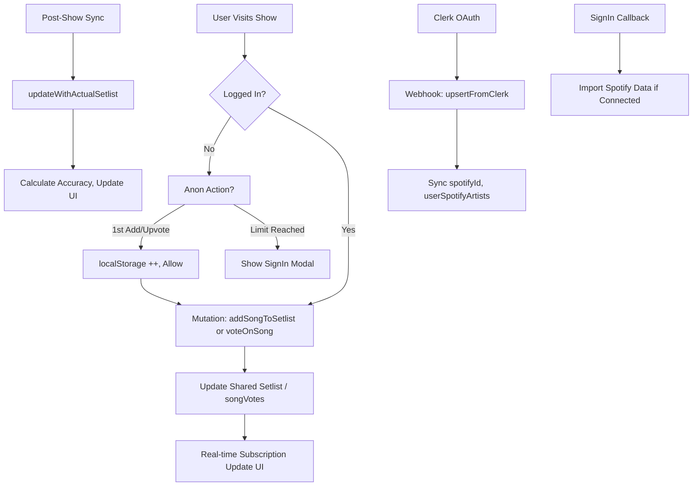

# Code Review Summary for Concert Setlist Voting App

## Overall Architecture
- **Frontend**: React with Vite, Tailwind CSS, Convex for real-time queries/mutations, Clerk for auth (email, Google, Spotify OAuth).
- **Backend**: Convex DB with tables for users, artists, shows, venues, songs, setlists, songVotes, votes, etc. Integrations with Ticketmaster, Setlist.fm, Spotify.
- **Key Flows**: User auth via Clerk syncs to Convex users via webhooks. Voting on song predictions for upcoming shows. Post-show, sync actual setlist from Setlist.fm and calculate accuracy.
- **Strengths**: Real-time updates via Convex subscriptions, modular components, good separation of concerns.
- **Areas for Improvement**: Anonymous voting limits not persistent, mixed UI icons for voting, incomplete dashboard/activity stats, potential auth gaps in anonymous tracking.

## Auth Audit (Clerk + Convex + OAuth)
- **Setup**: Clerk configured with email/password, Google, Spotify OAuth. SignInPage.tsx handles redirects to /sso-callback. Webhooks in webhooks.ts verify and sync user data to Convex users table.
- **Spotify/Google Integration**: OAuth strategies in SignInPage. Webhooks extract spotifyId from external_accounts. createAppUser in auth.ts handles upsert with admin promotion for specific email.
- **Session Syncing**: getAuthUserId uses Clerk identity to find Convex user by authId. loggedInUser query returns identity + appUser.
- **Issues**: No explicit anonymous session tracking. OAuth redirects work but no post-import for Spotify data in useEffect (commented placeholders). Webhooks handle create/update/delete correctly.
- **Security**: Webhook signature verification with Svix. No hard-coded secrets. Rate limiting via userActions table (not fully used).
- **Recommendations**: Add anonymous UUID via localStorage for vote tracking. Ensure Spotify import runs after OAuth callback. Test webhook payloads for edge cases (e.g., multiple external accounts).

## Voting System Analysis
- **Schema**: songVotes table supports anonymous (userId: "anonymous"), but frontend doesn't persist session. votes table for setlist-level (accurate/inaccurate), requires auth.
- **Implementation**: ShowDetail.tsx uses ChevronUp for active voting in SongVoteRow, Heart for post-show fan requests/actuals. addSongToSetlist mutation creates/updates shared setlist (!userId).
- **Anonymous Support**: Local state for actions (limit 4), but not persistent. No modal for sign-up prompt beyond onSignInRequired.
- **Limits**: Backend allows anonymous inserts but no enforcement. Frontend needs localStorage for cross-session persistence.
- **UI Issues**: Heart icon used for counts in FanRequestSongRow/ActualSetlistSongRow; revert to ChevronUp for consistency. Vote count shows below icon.
- **Fix Design**:
  - **Icon Unification**: Replace Heart with ChevronUp in all rows (FanRequestSongRow, ActualSetlistSongRow). Use fill-current for voted/played states.
  - **Anonymous Limit**: Use localStorage key 'anonActions_showId' with count (max 2: 1 add + 1 upvote). On action, increment; if >2, show modal like SignInPage.
  - **Modal**: Reuse SignInPage style, trigger onSignInRequired after limit.
  - **Persistence**: On add/vote, store action type + timestamp. Clear on sign-in.
  - **Backend**: Optional: Add anonymous vote cleanup cron if needed, but frontend enforcement suffices.
- **Other**: VotingButton.tsx for setlist-level (ThumbsUp/Down), but task focuses on song upvote.

## Activity/Dashboard Completeness
- **ActivityPage.tsx**: Basic structure with stats (votes, setlists, accuracy, streak), grouped feed, recent predictions. Gaps: Infinite scroll not implemented (List placeholder), real-time subscription fallback to polling, no vote accuracy query impl, empty activity items.
- **UserDashboard.tsx**: Simple stats (votes, shows voted, days active), Spotify artists, predictions. Gaps: No accuracy, streaks, full activity feed; UserPredictions shows recent votes but no details.
- **DashboardHome.tsx**: Search, trending artists/shows, CTA for anon. Complete for public view.
- **PublicDashboard.tsx**: Hero search, trending cards with animations. Functional but no anon limits here.
- **Enhancements Needed**:
  - Add vote accuracy query/mutation in activity.ts (compare user votes to actual setlists).
  - Implement infinite query for activity feed with grouping.
  - Real-time: Use subscriptions for stats/updates.
  - Dashboard: Add charts (accuracy over time), leaderboards, full predictions with accuracy.
  - Ensure mobile responsiveness, loading states.

## Integrations Validation Pending
- Spotify: spotify.ts/spotifyAuth.ts for auth/token handling, importUserSpotifyArtists.
- Setlist.fm/Ticketmaster: APIs in respective files, sync jobs.
- Security: No gaps in anon voting (backend allows but frontend limits); ensure no spam via rate limits.

## Auth/Voting Flow Diagram

## Next Steps
- Implement voting UI fix and anon limits in code mode.
- Add backend queries for accuracy/stats.
- Full file review for edge cases.
- Test auth flows end-to-end.

Approve this plan or suggest changes?